<div align="center">
  
</div>

---

```
┌────────────────────────────────────────────────────────────┐
│  ⚡ Full-Stack Developer  │  building things that matter   │
│  📍 India  •  open to collabs & opportunities              │
│  ✉  khushibha05@gmail.com                                  │
└────────────────────────────────────────────────────────────┘
```

---

### `visitor@github:~$ ls tech-stack/`

<div align="center">


</div>

---

### `visitor@github:~$ ./fetch-stats.sh`

<div align="center">


</div>

---

### `visitor@github:~$ cat streak.log`

<div align="center">

[](https://git.io/streak-stats)

</div>

---

### `visitor@github:~$ ./snake-contributions.sh`

<div align="center">

<picture>
  <source media="(prefers-color-scheme: dark)" srcset="https://raw.githubusercontent.com/okay-khushi/okay-khushi/output/github-contribution-grid-snake-dark.svg" />
  <source media="(prefers-color-scheme: light)" srcset="https://raw.githubusercontent.com/okay-khushi/okay-khushi/output/github-contribution-grid-snake.svg" />
  
</picture>

</div>

---

### `visitor@github:~$ cat connect.txt`

<div align="center">

[](https://github.com/okay-khushi)
[](https://linkedin.com/in/okay-khushi)
[](mailto:khushibha05@gmail.com)

</div>

---

<div align="center">

```
visitor@github:~$ echo "thanks for visiting — let's build something cool"
// "thanks for visiting — let's build something cool"
visitor@github:~$ █
```


</div>
